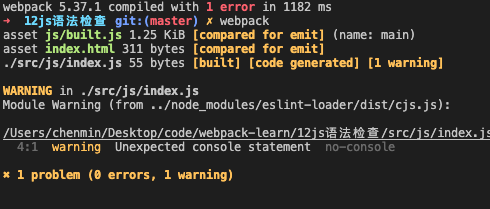

## 语法检查

规范：规范js代码风格、检查常见的语法错误，让代码不容易出问题
常用工具：eslint(下载eslint-loader eslint eslint-config-airbnb-base eslint-plugin-import)
注意:只检查用户写的源码，第三方库不检查
设置检查规则：在package.json中设置

```
npm i eslint-loader eslint eslint-config-airbnb-base eslint-plugin-import -D
```


package.json: 继承airbnb规则
```json
"eslintConfig": {
    "extends": "airbnb-base"
}
```

webpack.config.js
```js
 {
        test: /\.js$/,
        exclude: /node_modules/,
        loader: 'eslint-loader',
        options: {
          // 自动修复eslint的错误
          fix: true,
        }
      }
```

运行截图：

