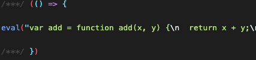

## js兼容处理

1. 基本js兼容性处理 @babel/preset。只能转换基本语法，如promise不能转换
2. 全部js兼容性处理 @babel/polyfill。直接引入～会导致js文件较大，比较暴力。
3. 按需加载js的兼容性能 corejs。

### 方案一 基本js兼容性处理
```
npm i -D @babel/preset @babel/core-env babel-loader
```

index.js

```js
const add = (x, y) => {
  return x + y;
}
```

webpack.config.js
```js
{
    test: /\.js$/,
    exclude: /node_modules/,
    loader: 'babel-loader',
    options: {
        // 预设： 只是babel做怎木样的兼容性处理
        presets: ['@babel/preset-env'],
    }
}
```


打包截图：



### 方案二 全部js兼容性处理
```js
import '@babel/polyfill'
const add = (x, y) => {
  return x + y;
}

const promise = new Promise((res) => {
  setTimeout(() => {
    console.log('定时器执行完了～');
    rres();
  },1000)
})
```

### 方案三 按需加载js的兼容性能
```js
      {
        test: /\.js$/,
        exclude: /node_modules/,
        loader: 'babel-loader',
        options: {
          // 预设： 只是babel做怎木样的兼容性处理
          presets: [
            [
              '@babel/preset-env',
              {
                // 按需加载
                useBuiltIns: 'usage',
                corejs: {
                  version: 3
                },
                // 指定兼容性具体做到哪个版本
                targets: {
                  chrome: '60',
                  ie: '9',
                  firefox: '60',
                  safari: '10',
                  edge: '17'
                }
              }
            ]
          ],
        }
      }
```

打包结果
