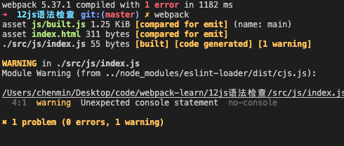

**wepack学习项目**
> [视频教程](https://www.bilibili.com/video/BV1e7411j7T5)

目录：

[toc]

## 15语法检查

规范：规范js代码风格、检查常见的语法错误，让代码不容易出问题
常用工具：eslint(下载eslint-loader eslint eslint-config-airbnb-base eslint-plugin-import)
注意:只检查用户写的源码，第三方库不检查
设置检查规则：在package.json中设置

```
npm i eslint-loader eslint eslint-config-airbnb-base eslint-plugin-import -D
```


package.json: 继承airbnb规则
```json
"eslintConfig": {
    "extends": "airbnb-base"
}
```

webpack.config.js
```js
 {
        test: /\.js$/,
        exclude: /node_modules/,
        loader: 'eslint-loader',
        options: {
          // 自动修复eslint的错误
          fix: true,
        }
      }
```

运行截图：



## 16js兼容处理

1. 基本js兼容性处理 @babel/preset。只能转换基本语法，如promise不能转换
2. 全部js兼容性处理 @babel/polyfill。直接引入～会导致js文件较大，比较暴力。
3. 按需加载js的兼容性能 corejs。

**方案一** 基本js兼容性处理
```
npm i -D @babel/preset @babel/core-env babel-loader
```

index.js

```js
const add = (x, y) => {
  return x + y;
}
```

webpack.config.js
```js
{
    test: /\.js$/,
    exclude: /node_modules/,
    loader: 'babel-loader',
    options: {
        // 预设： 只是babel做怎木样的兼容性处理
        presets: ['@babel/preset-env'],
    }
}
```


打包截图：


**方案二 全部js兼容性处理**
```js
import '@babel/polyfill'
const add = (x, y) => {
  return x + y;
}

const promise = new Promise((res) => {
  setTimeout(() => {
    console.log('定时器执行完了～');
    rres();
  },1000)
})
```

**方案三 按需加载js的兼容性能**
```js
      {
        test: /\.js$/,
        exclude: /node_modules/,
        loader: 'babel-loader',
        options: {
          // 预设： 只是babel做怎木样的兼容性处理
          presets: [
            [
              '@babel/preset-env',
              {
                // 按需加载
                useBuiltIns: 'usage',
                corejs: {
                  version: 3
                },
                // 指定兼容性具体做到哪个版本
                targets: {
                  chrome: '60',
                  ie: '9',
                  firefox: '60',
                  safari: '10',
                  edge: '17'
                }
              }
            ]
          ],
        }
      }
```

打包结果


## 17.js和html压缩

**1.js压缩**

webpack.config.js

```js
mode: 'production'
```

**2.html压缩**

```
plugins: [
    // 作用：创建空的html，引入打包输出的所有资源（js/css）
    new HtmlWebpackPlugin({
        // 需求： 需要有结构的html文件
        // 复制''./src/index.html',并自动引入打包输出的所有（js/css）
        template: './src/index.html',
        minify: {
            // 移除空格
            collapseWhitespace: true,
            // 清除注释
            removeComments: true
        }
    })

],
```

